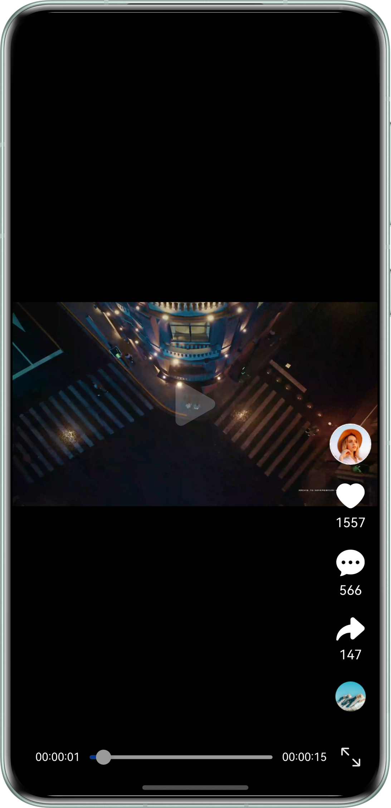
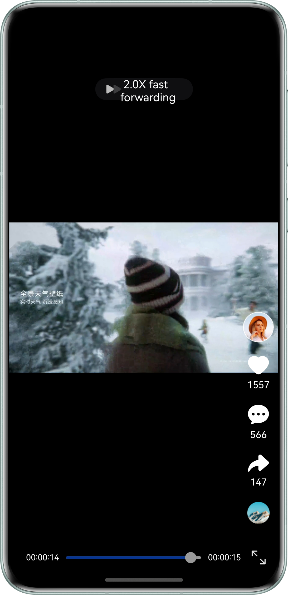

# Playing Short Videos Using the Video Component

## Overview

This sample shows how to play short videos by using the Video component, including basic playback control, custom
progress bar, full-screen playback, seek playback, playback speed adjustment, automatic playback continuation, volume
setting, and foreground/background status awareness.

## Preview

| Basic Playback Control              | Playback Speed Adjustment              | Volume Setting                      |           
|-------------------------------------|----------------------------------------|-------------------------------------|
|  |  |  |

| Full-Screen Playback                | 
|-------------------------------------|
|  |

## How to Use

1. After the app is launched, the video automatically plays. You can tap the video feed to pause the playback and tap it
   again to resume the playback.
2. Tap or drag the progress bar to jump to a specified time point.
3. Long-press the left or right side of the video feed to switch the playback speed to 2x.
4. Long-press the video feed and swipe vertically to display the volume control bar. Swipe up to increase the volume and
   swipe down to decrease the volume.
5. Tap the full-screen button on the right side of the progress bar or place the device horizontally to enter the
   full-screen mode. After entering the full-screen mode, tap the back button to exit.
6. When the app transitions to the background, the video automatically pauses. When the app is brought back to the
   foreground, the video resumes from the paused position.
7. After the current video ends, the playback will automatically continue with the next video.

## Project Directory

```
├───entry/src/main/ets 
│   ├───common                         
│   │   ├───TimeUtils.ets                   // Time utility. 
│   │   ├───VideoData.ets                   // Video resource. 
│   │   ├───VideoDataModel.ets              // Video definition class. 
│   │   └───WindowUtil.ets      	        // Window utility. 
│   ├───constants                                
│   │   └───CommonConstants.ets             // Common constants. 
│   ├───entryability                         
│   │   └───EntryAbility.ets                // Entry ability lifecycle callbacks. 
│   ├───entrybackupability                   
│   │   └───EntryBackupAbility.ets          // App backup and restoration. 
│   ├───pages                                
│   │   └───Index.ets                       // Home page. 
│   └───view 
│       ├───SetVolume.ets                   // Volume adjustment                              
│       └───VideoPlayer.ets                 // Video playback. 
└───entry/src/main/resources                // Resources  

```

## How to Implement

1. Create VideoController and call its start() and pause() methods to play and pause the video, respectively.
2. Set the controls attribute of the Video component to false to disable the component's built-in control bar. Use the
   Slider component to implement a custom progress bar and call setCurrentTime() to specify a video playback progress
   position for seek playback.
3. Use the LongPressGesture() event to set the playback speed parameter currentProgressRate of the Video component to
   Speed_Forward_2_00_X for 2x playback.
4. Use the combined gesture event of long-pressing and swiping to display the AVVolumePanel volume panel and set the
   volume.
5. Call the setPreferredOrientation method of the window to set the display orientation attribute of the main window to
   implement landscape/portrait switching.
6. Use the onForeground() and onBackground() lifecycle methods to listen to the foreground and background status of the
   current app. When the app is in the background, the video playback pauses. When the app returns to the foreground,
   the video playback resumes.
7. After the video playback is complete, call the showNext() method of the Swiper component to go to the next video. In
   addition, call the start() method of the Video component in the Swiper switch callback to play the video,
   implementing automatic playback continuation.

## Required Permissions

- N/A

## Dependencies

- N/A

## Constraints

1. This sample is only supported on bar-type phones running standard systems.
2. The HarmonyOS version must be HarmonyOS 6.0.2 Release or later.
3. The DevEco Studio version must be DevEco Studio 6.0.2 Release or later.
4. The HarmonyOS SDK version must be HarmonyOS 6.0.2 Release SDK or later.


